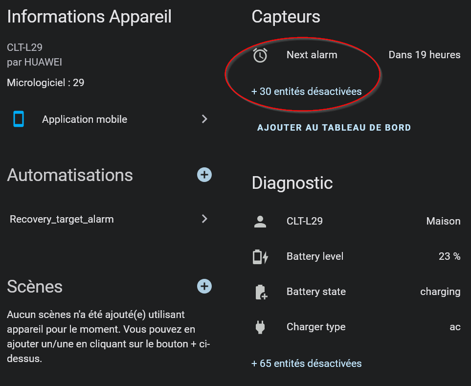

# FAQ

## How to set phone next_alarm as target time?
- First activate next alarm sensor in HA (https://companion.home-assistant.io/docs/core/sensors/#sensor-list):
  - Navigate to [Settings](https://my.home-assistant.io/redirect/config/) > Companion App > Manage Sensors
  - By default, most are disabled -> activate in the list sensor.yourphone_next_alarm
   
- Copy/paste the name of the sensor (e.g. `sensor.clt_l29_next_alarm`) in the [smartHRT dashboard](https://github.com/ebozonne/SmartHRT?tab=readme-ov-file#interface)

## What are the detailed stages from the heating stop time to the wake up time?
1) At `Heating stop time` triggers the lag detection automation (`automation.detect_temperature_decrease_start_time`) that will monitor the interior temperature until it "really" starts decreasing (-0.2°C detected)
2) `recovery_calc_mode` is then activated (lag detection is then deactivated) and `automation.trigger_target_hour_calc` recomputes regularly the recovery start time considering future exterior temperature and future wind
3) At `recovery_start_time` the `RCth` value is assessed from the previous exterior and interior temperature evolutions, which modifies `RCth_lw` and `RCth_hw` if self calibration is activated (wind dependant)
4) `rp_calc_mode` is activated as normally the radiator is now ON (recovery) until the wake-up time OR sooner if the set point `tsp` is reached before
5) End of the cycle, `RPth_lw` and `RPth_hw` are self calibrated in the same was as `RCth_lw` and `RCth_hw`

## How to check if something went wrong?
Look at the history of the involved automations at various steps

## How to manually correct the `RCth` and `RPth` constant values?
Deactivate the self calibration and edit the values, by default in the first run if values are 0, these will be set to 50h and 50°C, but this can be changed anytime and tested with the manual run of the script to see the estimated recovery start time.
