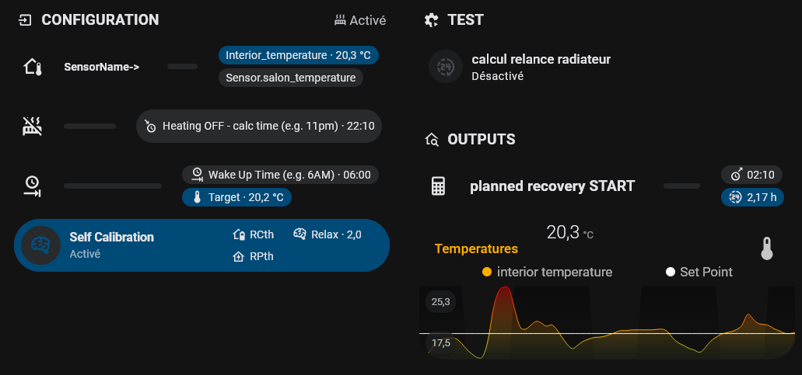

# SmartHRT
Smart Heating Recovery Time calculation for Home Assistant

# Table of Contents
1. [Concepts](#concepts)
2. [Why there is a self-calibration script?](#why-there-is-a-self-calibration-script)
3. [Interface](#interface)
4. [Installation](#installation)
5. [Testing and using the recovery optimization](#testing-and-using-the-recovery-optimization)
6. [TODO](#todo)

## Concepts
> Why do I need it?
The thermal mass of my radiators and walls provides good thermal comfort but makes it hard to predict the heating recovery time in the morning.
Without predicting the correct time to start heating at night, it is either too late (and too cold) or too soon (heating the living room unnecessarily while sleeping).

The principle is simple: while sleeping, heating can be completely turned off and boosted at the correct `recovery time`.

The challenge is to identify the `recovery time`, neither too soon (to avoid wasting money, emitting CO2, and using excess kWh), nor too late (to obtain thermal comfort). This problem involves:

- 2 variables: interior & exterior temperatures (`Tint` & `Text`)
- 1 objective: set point temperature `Tsp` at wake up time `target_hour`

## Why there is a self-calibration script?
> Every home is unique, but when it comes to room temperature evolution, physics can simplify things to just two parameters:
> - `RCth`: this combines your home's insulation (including air infiltrations) & its effective thermal mass (emitter, furniture, walls, ...)
> - `RPth`: this combines the same insulation & the effective heating power

Both RCth & RPth are necessary to determine the `recovery time`

$$ recoveryTime = RC_{th} \cdot ln \left( \frac {RP_{th}+T_{ext}-T_{int}^{START}} {RP_{th}+T_{ext}-T_{sp}} \right) $$

Damned, unlike many existing controllers, this is clearly non-linear!

The "magic" of this program is to figure out and adjust $`RC_{th}`$ and $`RP_{th}`$ by monitoring your temperatures with a `relaxation` parameter :)

## Interface

> NOTE: disable `Recovery time calculation CONFIGURATION` during the holydays and the non-heating seasons

- `CONFIGURATION` panel (4 inputs required):
  - interior temperature `sensor name` (default: my own indoor sensor -> `sensor.salon_temperature`)
  - time of heating interruption (`recoverycalc_hour`) - e.g. 11PM
  - wake-up time (`target_hour`) - e.g. 6AM
  - target temperature (`tsp`) - e.g. 20°C
    
  Default adaptive mode (can be adjusted or deactivated for further manual tuning -> see advanced mode):
  - `Self Calibration` (activated by default) which computes coefficients for your own room after each recovery cycle
- `TEST`panel: run the calculation script to check the predicted `recovery time`. The script predicts the decrease in `Tint` before `recovery time` based on room constants
- `OUTPUTS` panel:
  - predicted `recovery time`
  - interior temperature graph
 
## Installation

### Requirements
- For script and automation package:
  - Set up a package folder if not already done (see https://www.home-assistant.io/docs/configuration/packages/)
- For dashboard interface:
  - [HACS](https://www.home-assistant.io/blog/2024/08/21/hacs-the-best-way-to-share-community-made-projects/#how-to-install)
  - [Lovelace-Mushroom](https://github.com/piitaya/lovelace-mushroom)
  - [Bubble-Card](https://github.com/Clooos/Bubble-Card)
  - [Mini-Graph-Card](https://github.com/kalkih/mini-graph-card)
  - [Lovelace-Card-Mod](https://github.com/thomasloven/lovelace-card-mod)
- A simple calendar, timetable, and/or automation for heating during the week to know the interruption time at night (and to set the `recoverycalc_hour` correctly)

### Download and install
- Download [thermal_recovery_time.yaml](packages/thermal_recovery_time.yaml) and copy the file to your package folder
- Restart Home Assistant
- Download [dashboard_base.yaml](dashboard_base.yaml)
  - open the file with a text editor
  - in your Home Assistant dashboard, click on the 3 dots in the upper right corner and add a tab
  - on the new blank tab, click on edit > 3 dots in the upper right corner > select YAML edition
  - copy and paste the content of `dashboard_base.yaml` -> save.
- Add the calculated recovery time (`input_datetime.recoverystart_hour`) as a condition to start the radiators (amongst the other calendar rules) in your own automation

e.g. I have this automation to manage my radiatiors

## Testing and using the recovery optimization
- Configure the 4 required inputs
- Test the script for the calculation of `recovery time`
- Check next morning if everything went well - The `Self Calibration` requires a few days to adapt `RCth`and `RPth`constants for better predictions; the first night may not be accurate. Following days should give better predictions with self calibration mode (further manual adjustments are always possible in advanced mode)

# TODO
- ADD readme for advanced use
- ADD automatic wind correlation for `Rth` variations (important for old buildings with high infiltration rates, and high-rise buildings)
- ADD recovery optimization based on energy prices and periods (e.g. TEMPO in France)
- ADD predicted exterior temperature (weather data) in the recovery time calculation (important for very cold mornings)
- ADD solar radiation effects (weather data) for a future diurnal recovery time calculation
- ADD second order effects for vacation recovery calculation vs. typical weekly occupancy variations.
- INTEGRATE all variables and parameters into a single entity to manage different rooms (important for castle owners)
